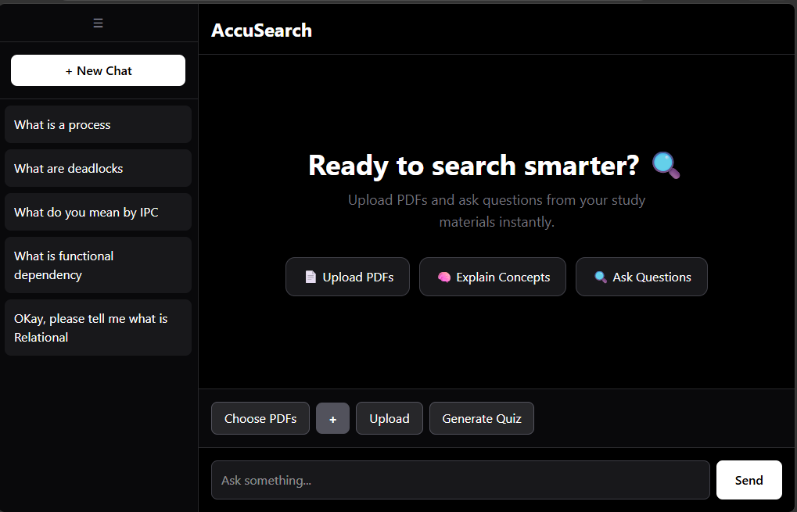
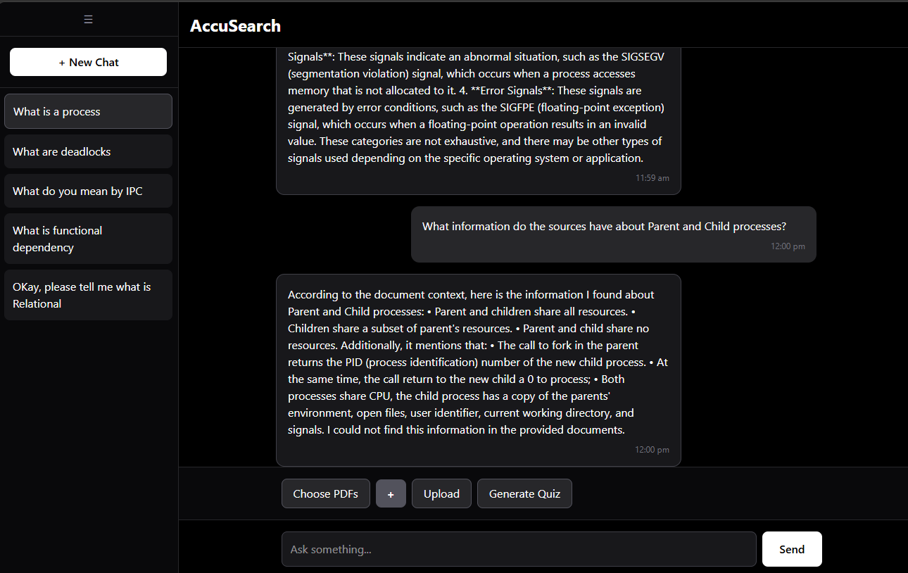
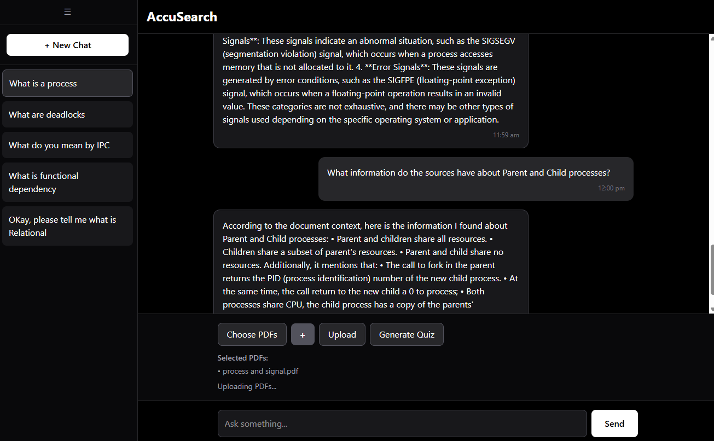
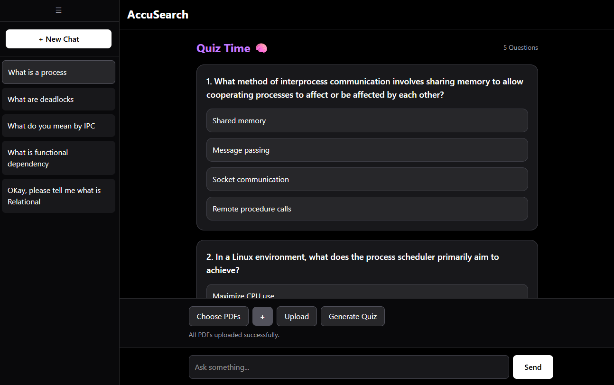
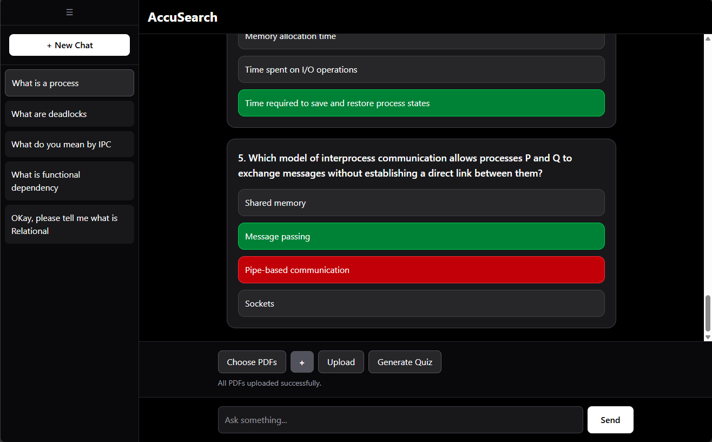
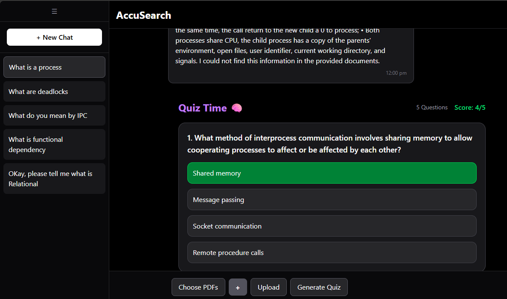

# AccuSearch — AI-Powered Document Grounded Study Assistant

An AI-powered study assistant built to help students learn directly from **their own course PDFs** through contextual Q&A and automated quiz generation.

Unlike traditional AI study tools that often answer using generalized pretrained knowledge, **AccuSearch prioritizes retrieved document context**, helping students study from the same material used in academic evaluation.

---

## Why I Built This

As a student, I realized that most AI study assistants often explain concepts using their general training rather than strictly grounding responses in uploaded course material.

In my coursework, this became a real problem: professors expected answers to follow the explanations and terminology used in lecture PDFs and academic notes. While existing AI tools could summarize topics well, they often paraphrased heavily, generalized concepts, or generated answers that drifted away from the exact wording and context of the provided documents.

This created a gap between **understanding a concept** and **scoring well in an academic setting**.

I built **AccuSearch** to solve that problem.

AccuSearch is a document-grounded AI study assistant designed to retrieve information directly from uploaded PDFs, generate context-aware responses, and preserve alignment with source material. Instead of relying only on pretrained knowledge, it prioritizes retrieved document context, helping students study from the exact material they are being evaluated on.

To make studying more active, I also added **automated quiz generation grounded in uploaded documents**, allowing students to test their understanding without manually creating practice questions.

**Goal:** Build an AI study assistant that helps students learn while staying faithful to the material that actually determines their grades.

---

## Features

### Contextual PDF Q&A

* Upload academic PDFs and ask questions naturally
* Retrieval-grounded responses using document context
* Context-aware multi-turn conversations

### Multi-Conversation Memory

* Persistent chat sessions
* Auto-generated chat titles
* Rename and delete conversations

### Automated Quiz Generation

* Generate document-grounded MCQs from uploaded PDFs
* Interactive quiz UI with answer validation
* Score tracking and feedback system

### Modern UX

* Smooth typing animation
* Collapsible sidebar
* Auto-scroll chat
* Timestamped conversations
* Clean responsive interface

---

## Tech Stack

### Frontend

* React.js
* Tailwind CSS
* Axios

### Backend

* FastAPI
* LangChain
* ChromaDB
* Postgres

### AI / ML

* Ollama (llama3)
* Qwen2.5:7B
* Sentence Transformers
* Retrieval-Augmented Generation (RAG)

### Infrastructure

* Docker
* REST APIs

---

## System Architecture

```text
PDF Upload
    ↓
Text Chunking
    ↓
Embeddings Generation
    ↓
ChromaDB Vector Store
    ↓
Semantic Retrieval
    ↓
Local LLM (Qwen2.5)
    ↓
Contextual Answers / Quiz Generation
```

---

## Performance Metrics

* **90% retrieval accuracy** across **50 benchmark academic QA prompts**
* **~30ms average retrieval latency**
* Retrieval evaluated using keyword-grounded contextual benchmarking
* Quiz generation constrained through retrieval-grounded prompting and structured JSON generation

---

## Screenshots

### Home Interface



### Contextual Chat



### Uploading pdfs



### Quiz







## Local Setup

### Clone Repository

```bash
git clone <git@github.com:tWiLighT-xY91/rag-realtime.git>
cd rag-realtime
```

### Backend Setup

```bash
cd backend

pip install -r requirements.txt

uvicorn main:app --reload
```

### Frontend Setup

```bash
cd frontend

npm install

npm run dev
```

### Run Ollama Model

```bash
ollama pull llama3
ollama run llama3
ollama pull qwen2.5:7b
ollama run qwen2.5:7b
```

---

## Future Improvements

* Flashcard generation
* Page-level citations in responses
* Adaptive quiz difficulty
* Spaced repetition support
* Cloud deployment
* Authentication system

---

## License

MIT License